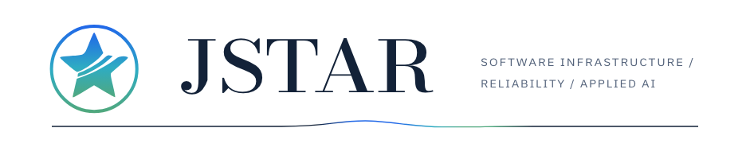
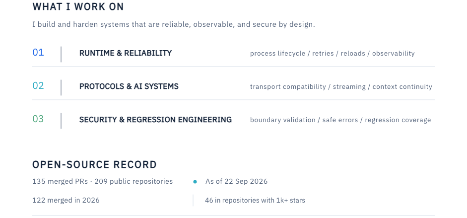
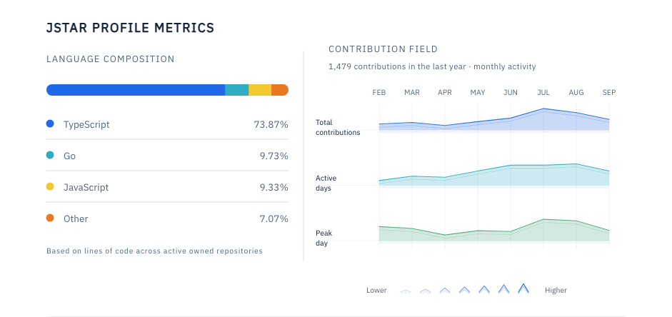

<a href="https://github.com/jstar0" aria-label="Profile identity"><picture><source media="(prefers-color-scheme: dark) and (max-width: 640px) and (prefers-reduced-data: reduce)" type="image/png" srcset="./assets/profile-narrow-dark-split-header-static.png"><source media="(prefers-color-scheme: dark) and (min-width: 641px) and (prefers-reduced-data: reduce)" type="image/png" srcset="./assets/profile-wide-dark-split-header-static.png"><source media="(prefers-color-scheme: light) and (max-width: 640px) and (prefers-reduced-data: reduce)" type="image/png" srcset="./assets/profile-narrow-split-header-static.png"><source media="(prefers-color-scheme: light) and (min-width: 641px) and (prefers-reduced-data: reduce)" type="image/png" srcset="./assets/profile-wide-split-header-static.png"><source media="(prefers-color-scheme: dark) and (max-width: 640px) and (prefers-reduced-motion: reduce)" type="image/svg+xml" srcset="./assets/profile-narrow-dark-split-header-static.svg"><source media="(prefers-color-scheme: dark) and (min-width: 641px) and (prefers-reduced-motion: reduce)" type="image/svg+xml" srcset="./assets/profile-wide-dark-split-header-static.svg"><source media="(prefers-color-scheme: light) and (max-width: 640px) and (prefers-reduced-motion: reduce)" type="image/svg+xml" srcset="./assets/profile-narrow-split-header-static.svg"><source media="(prefers-color-scheme: light) and (min-width: 641px) and (prefers-reduced-motion: reduce)" type="image/svg+xml" srcset="./assets/profile-wide-split-header-static.svg"><source media="(prefers-color-scheme: dark) and (max-width: 640px)" type="image/svg+xml" srcset="./assets/profile-narrow-dark-split-header.svg"><source media="(prefers-color-scheme: dark) and (min-width: 641px)" type="image/svg+xml" srcset="./assets/profile-wide-dark-split-header.svg"><source media="(prefers-color-scheme: light) and (max-width: 640px)" type="image/svg+xml" srcset="./assets/profile-narrow-split-header.svg"><source media="(prefers-color-scheme: light) and (min-width: 641px)" type="image/svg+xml" srcset="./assets/profile-wide-split-header.svg"><source media="(prefers-color-scheme: dark) and (max-width: 640px)" type="image/png" srcset="./assets/profile-narrow-dark-split-header-static.png"><source media="(prefers-color-scheme: dark) and (min-width: 641px)" type="image/png" srcset="./assets/profile-wide-dark-split-header-static.png"><source media="(prefers-color-scheme: light) and (max-width: 640px)" type="image/png" srcset="./assets/profile-narrow-split-header-static.png"><source media="(prefers-color-scheme: light) and (min-width: 641px)" type="image/png" srcset="./assets/profile-wide-split-header-static.png"></picture></a>

<picture><source media="(prefers-color-scheme: dark) and (max-width: 640px) and (prefers-reduced-data: reduce)" type="image/png" srcset="./assets/profile-narrow-dark-split-overview-static.png"><source media="(prefers-color-scheme: dark) and (min-width: 641px) and (prefers-reduced-data: reduce)" type="image/png" srcset="./assets/profile-wide-dark-split-overview-static.png"><source media="(prefers-color-scheme: light) and (max-width: 640px) and (prefers-reduced-data: reduce)" type="image/png" srcset="./assets/profile-narrow-split-overview-static.png"><source media="(prefers-color-scheme: light) and (min-width: 641px) and (prefers-reduced-data: reduce)" type="image/png" srcset="./assets/profile-wide-split-overview-static.png"><source media="(prefers-color-scheme: dark) and (max-width: 640px)" type="image/svg+xml" srcset="./assets/profile-narrow-dark-split-overview-static.svg"><source media="(prefers-color-scheme: dark) and (min-width: 641px)" type="image/svg+xml" srcset="./assets/profile-wide-dark-split-overview-static.svg"><source media="(prefers-color-scheme: light) and (max-width: 640px)" type="image/svg+xml" srcset="./assets/profile-narrow-split-overview-static.svg"><source media="(prefers-color-scheme: light) and (min-width: 641px)" type="image/svg+xml" srcset="./assets/profile-wide-split-overview-static.svg"><source media="(prefers-color-scheme: dark) and (max-width: 640px)" type="image/png" srcset="./assets/profile-narrow-dark-split-overview-static.png"><source media="(prefers-color-scheme: dark) and (min-width: 641px)" type="image/png" srcset="./assets/profile-wide-dark-split-overview-static.png"><source media="(prefers-color-scheme: light) and (max-width: 640px)" type="image/png" srcset="./assets/profile-narrow-split-overview-static.png"><source media="(prefers-color-scheme: light) and (min-width: 641px)" type="image/png" srcset="./assets/profile-wide-split-overview-static.png"></picture>

<a href="https://github.com/openai/openai-agents-python" aria-label="Repository openai/openai-agents-python"><picture><source media="(prefers-color-scheme: dark) and (max-width: 640px) and (prefers-reduced-data: reduce)" type="image/png" srcset="./assets/profile-narrow-dark-split-open-01-repo-static.png"><source media="(prefers-color-scheme: dark) and (min-width: 641px) and (prefers-reduced-data: reduce)" type="image/png" srcset="./assets/profile-wide-dark-split-open-01-repo-static.png"><source media="(prefers-color-scheme: light) and (max-width: 640px) and (prefers-reduced-data: reduce)" type="image/png" srcset="./assets/profile-narrow-split-open-01-repo-static.png"><source media="(prefers-color-scheme: light) and (min-width: 641px) and (prefers-reduced-data: reduce)" type="image/png" srcset="./assets/profile-wide-split-open-01-repo-static.png"><source media="(prefers-color-scheme: dark) and (max-width: 640px)" type="image/svg+xml" srcset="./assets/profile-narrow-dark-split-open-01-repo-static.svg"><source media="(prefers-color-scheme: dark) and (min-width: 641px)" type="image/svg+xml" srcset="./assets/profile-wide-dark-split-open-01-repo-static.svg"><source media="(prefers-color-scheme: light) and (max-width: 640px)" type="image/svg+xml" srcset="./assets/profile-narrow-split-open-01-repo-static.svg"><source media="(prefers-color-scheme: light) and (min-width: 641px)" type="image/svg+xml" srcset="./assets/profile-wide-split-open-01-repo-static.svg"><source media="(prefers-color-scheme: dark) and (max-width: 640px)" type="image/png" srcset="./assets/profile-narrow-dark-split-open-01-repo-static.png"><source media="(prefers-color-scheme: dark) and (min-width: 641px)" type="image/png" srcset="./assets/profile-wide-dark-split-open-01-repo-static.png"><source media="(prefers-color-scheme: light) and (max-width: 640px)" type="image/png" srcset="./assets/profile-narrow-split-open-01-repo-static.png"><source media="(prefers-color-scheme: light) and (min-width: 641px)" type="image/png" srcset="./assets/profile-wide-split-open-01-repo-static.png"></picture></a><a href="https://github.com/openai/openai-agents-python/pull/3939" aria-label="Pull request openai/openai-agents-python #3939"><picture><source media="(prefers-color-scheme: dark) and (max-width: 640px) and (prefers-reduced-data: reduce)" type="image/png" srcset="./assets/profile-narrow-dark-split-open-01-pr-static.png"><source media="(prefers-color-scheme: dark) and (min-width: 641px) and (prefers-reduced-data: reduce)" type="image/png" srcset="./assets/profile-wide-dark-split-open-01-pr-static.png"><source media="(prefers-color-scheme: light) and (max-width: 640px) and (prefers-reduced-data: reduce)" type="image/png" srcset="./assets/profile-narrow-split-open-01-pr-static.png"><source media="(prefers-color-scheme: light) and (min-width: 641px) and (prefers-reduced-data: reduce)" type="image/png" srcset="./assets/profile-wide-split-open-01-pr-static.png"><source media="(prefers-color-scheme: dark) and (max-width: 640px)" type="image/svg+xml" srcset="./assets/profile-narrow-dark-split-open-01-pr-static.svg"><source media="(prefers-color-scheme: dark) and (min-width: 641px)" type="image/svg+xml" srcset="./assets/profile-wide-dark-split-open-01-pr-static.svg"><source media="(prefers-color-scheme: light) and (max-width: 640px)" type="image/svg+xml" srcset="./assets/profile-narrow-split-open-01-pr-static.svg"><source media="(prefers-color-scheme: light) and (min-width: 641px)" type="image/svg+xml" srcset="./assets/profile-wide-split-open-01-pr-static.svg"><source media="(prefers-color-scheme: dark) and (max-width: 640px)" type="image/png" srcset="./assets/profile-narrow-dark-split-open-01-pr-static.png"><source media="(prefers-color-scheme: dark) and (min-width: 641px)" type="image/png" srcset="./assets/profile-wide-dark-split-open-01-pr-static.png"><source media="(prefers-color-scheme: light) and (max-width: 640px)" type="image/png" srcset="./assets/profile-narrow-split-open-01-pr-static.png"><source media="(prefers-color-scheme: light) and (min-width: 641px)" type="image/png" srcset="./assets/profile-wide-split-open-01-pr-static.png"></picture></a>

<a href="https://github.com/microsoft/semantic-kernel" aria-label="Repository microsoft/semantic-kernel"><picture><source media="(prefers-color-scheme: dark) and (max-width: 640px) and (prefers-reduced-data: reduce)" type="image/png" srcset="./assets/profile-narrow-dark-split-open-02-repo-static.png"><source media="(prefers-color-scheme: dark) and (min-width: 641px) and (prefers-reduced-data: reduce)" type="image/png" srcset="./assets/profile-wide-dark-split-open-02-repo-static.png"><source media="(prefers-color-scheme: light) and (max-width: 640px) and (prefers-reduced-data: reduce)" type="image/png" srcset="./assets/profile-narrow-split-open-02-repo-static.png"><source media="(prefers-color-scheme: light) and (min-width: 641px) and (prefers-reduced-data: reduce)" type="image/png" srcset="./assets/profile-wide-split-open-02-repo-static.png"><source media="(prefers-color-scheme: dark) and (max-width: 640px)" type="image/svg+xml" srcset="./assets/profile-narrow-dark-split-open-02-repo-static.svg"><source media="(prefers-color-scheme: dark) and (min-width: 641px)" type="image/svg+xml" srcset="./assets/profile-wide-dark-split-open-02-repo-static.svg"><source media="(prefers-color-scheme: light) and (max-width: 640px)" type="image/svg+xml" srcset="./assets/profile-narrow-split-open-02-repo-static.svg"><source media="(prefers-color-scheme: light) and (min-width: 641px)" type="image/svg+xml" srcset="./assets/profile-wide-split-open-02-repo-static.svg"><source media="(prefers-color-scheme: dark) and (max-width: 640px)" type="image/png" srcset="./assets/profile-narrow-dark-split-open-02-repo-static.png"><source media="(prefers-color-scheme: dark) and (min-width: 641px)" type="image/png" srcset="./assets/profile-wide-dark-split-open-02-repo-static.png"><source media="(prefers-color-scheme: light) and (max-width: 640px)" type="image/png" srcset="./assets/profile-narrow-split-open-02-repo-static.png"><source media="(prefers-color-scheme: light) and (min-width: 641px)" type="image/png" srcset="./assets/profile-wide-split-open-02-repo-static.png"></picture></a><a href="https://github.com/microsoft/semantic-kernel/pull/14166" aria-label="Pull request microsoft/semantic-kernel #14166"><picture><source media="(prefers-color-scheme: dark) and (max-width: 640px) and (prefers-reduced-data: reduce)" type="image/png" srcset="./assets/profile-narrow-dark-split-open-02-pr-static.png"><source media="(prefers-color-scheme: dark) and (min-width: 641px) and (prefers-reduced-data: reduce)" type="image/png" srcset="./assets/profile-wide-dark-split-open-02-pr-static.png"><source media="(prefers-color-scheme: light) and (max-width: 640px) and (prefers-reduced-data: reduce)" type="image/png" srcset="./assets/profile-narrow-split-open-02-pr-static.png"><source media="(prefers-color-scheme: light) and (min-width: 641px) and (prefers-reduced-data: reduce)" type="image/png" srcset="./assets/profile-wide-split-open-02-pr-static.png"><source media="(prefers-color-scheme: dark) and (max-width: 640px)" type="image/svg+xml" srcset="./assets/profile-narrow-dark-split-open-02-pr-static.svg"><source media="(prefers-color-scheme: dark) and (min-width: 641px)" type="image/svg+xml" srcset="./assets/profile-wide-dark-split-open-02-pr-static.svg"><source media="(prefers-color-scheme: light) and (max-width: 640px)" type="image/svg+xml" srcset="./assets/profile-narrow-split-open-02-pr-static.svg"><source media="(prefers-color-scheme: light) and (min-width: 641px)" type="image/svg+xml" srcset="./assets/profile-wide-split-open-02-pr-static.svg"><source media="(prefers-color-scheme: dark) and (max-width: 640px)" type="image/png" srcset="./assets/profile-narrow-dark-split-open-02-pr-static.png"><source media="(prefers-color-scheme: dark) and (min-width: 641px)" type="image/png" srcset="./assets/profile-wide-dark-split-open-02-pr-static.png"><source media="(prefers-color-scheme: light) and (max-width: 640px)" type="image/png" srcset="./assets/profile-narrow-split-open-02-pr-static.png"><source media="(prefers-color-scheme: light) and (min-width: 641px)" type="image/png" srcset="./assets/profile-wide-split-open-02-pr-static.png"></picture></a>

<a href="https://github.com/modelcontextprotocol/rust-sdk" aria-label="Repository modelcontextprotocol/rust-sdk"><picture><source media="(prefers-color-scheme: dark) and (max-width: 640px) and (prefers-reduced-data: reduce)" type="image/png" srcset="./assets/profile-narrow-dark-split-open-03-repo-static.png"><source media="(prefers-color-scheme: dark) and (min-width: 641px) and (prefers-reduced-data: reduce)" type="image/png" srcset="./assets/profile-wide-dark-split-open-03-repo-static.png"><source media="(prefers-color-scheme: light) and (max-width: 640px) and (prefers-reduced-data: reduce)" type="image/png" srcset="./assets/profile-narrow-split-open-03-repo-static.png"><source media="(prefers-color-scheme: light) and (min-width: 641px) and (prefers-reduced-data: reduce)" type="image/png" srcset="./assets/profile-wide-split-open-03-repo-static.png"><source media="(prefers-color-scheme: dark) and (max-width: 640px)" type="image/svg+xml" srcset="./assets/profile-narrow-dark-split-open-03-repo-static.svg"><source media="(prefers-color-scheme: dark) and (min-width: 641px)" type="image/svg+xml" srcset="./assets/profile-wide-dark-split-open-03-repo-static.svg"><source media="(prefers-color-scheme: light) and (max-width: 640px)" type="image/svg+xml" srcset="./assets/profile-narrow-split-open-03-repo-static.svg"><source media="(prefers-color-scheme: light) and (min-width: 641px)" type="image/svg+xml" srcset="./assets/profile-wide-split-open-03-repo-static.svg"><source media="(prefers-color-scheme: dark) and (max-width: 640px)" type="image/png" srcset="./assets/profile-narrow-dark-split-open-03-repo-static.png"><source media="(prefers-color-scheme: dark) and (min-width: 641px)" type="image/png" srcset="./assets/profile-wide-dark-split-open-03-repo-static.png"><source media="(prefers-color-scheme: light) and (max-width: 640px)" type="image/png" srcset="./assets/profile-narrow-split-open-03-repo-static.png"><source media="(prefers-color-scheme: light) and (min-width: 641px)" type="image/png" srcset="./assets/profile-wide-split-open-03-repo-static.png"></picture></a><a href="https://github.com/modelcontextprotocol/rust-sdk/pull/914" aria-label="Pull request modelcontextprotocol/rust-sdk #914"><picture><source media="(prefers-color-scheme: dark) and (max-width: 640px) and (prefers-reduced-data: reduce)" type="image/png" srcset="./assets/profile-narrow-dark-split-open-03-pr-static.png"><source media="(prefers-color-scheme: dark) and (min-width: 641px) and (prefers-reduced-data: reduce)" type="image/png" srcset="./assets/profile-wide-dark-split-open-03-pr-static.png"><source media="(prefers-color-scheme: light) and (max-width: 640px) and (prefers-reduced-data: reduce)" type="image/png" srcset="./assets/profile-narrow-split-open-03-pr-static.png"><source media="(prefers-color-scheme: light) and (min-width: 641px) and (prefers-reduced-data: reduce)" type="image/png" srcset="./assets/profile-wide-split-open-03-pr-static.png"><source media="(prefers-color-scheme: dark) and (max-width: 640px)" type="image/svg+xml" srcset="./assets/profile-narrow-dark-split-open-03-pr-static.svg"><source media="(prefers-color-scheme: dark) and (min-width: 641px)" type="image/svg+xml" srcset="./assets/profile-wide-dark-split-open-03-pr-static.svg"><source media="(prefers-color-scheme: light) and (max-width: 640px)" type="image/svg+xml" srcset="./assets/profile-narrow-split-open-03-pr-static.svg"><source media="(prefers-color-scheme: light) and (min-width: 641px)" type="image/svg+xml" srcset="./assets/profile-wide-split-open-03-pr-static.svg"><source media="(prefers-color-scheme: dark) and (max-width: 640px)" type="image/png" srcset="./assets/profile-narrow-dark-split-open-03-pr-static.png"><source media="(prefers-color-scheme: dark) and (min-width: 641px)" type="image/png" srcset="./assets/profile-wide-dark-split-open-03-pr-static.png"><source media="(prefers-color-scheme: light) and (max-width: 640px)" type="image/png" srcset="./assets/profile-narrow-split-open-03-pr-static.png"><source media="(prefers-color-scheme: light) and (min-width: 641px)" type="image/png" srcset="./assets/profile-wide-split-open-03-pr-static.png"></picture></a>

<a href="https://github.com/open-telemetry/opentelemetry-go" aria-label="Repository open-telemetry/opentelemetry-go"><picture><source media="(prefers-color-scheme: dark) and (max-width: 640px) and (prefers-reduced-data: reduce)" type="image/png" srcset="./assets/profile-narrow-dark-split-open-04-repo-static.png"><source media="(prefers-color-scheme: dark) and (min-width: 641px) and (prefers-reduced-data: reduce)" type="image/png" srcset="./assets/profile-wide-dark-split-open-04-repo-static.png"><source media="(prefers-color-scheme: light) and (max-width: 640px) and (prefers-reduced-data: reduce)" type="image/png" srcset="./assets/profile-narrow-split-open-04-repo-static.png"><source media="(prefers-color-scheme: light) and (min-width: 641px) and (prefers-reduced-data: reduce)" type="image/png" srcset="./assets/profile-wide-split-open-04-repo-static.png"><source media="(prefers-color-scheme: dark) and (max-width: 640px)" type="image/svg+xml" srcset="./assets/profile-narrow-dark-split-open-04-repo-static.svg"><source media="(prefers-color-scheme: dark) and (min-width: 641px)" type="image/svg+xml" srcset="./assets/profile-wide-dark-split-open-04-repo-static.svg"><source media="(prefers-color-scheme: light) and (max-width: 640px)" type="image/svg+xml" srcset="./assets/profile-narrow-split-open-04-repo-static.svg"><source media="(prefers-color-scheme: light) and (min-width: 641px)" type="image/svg+xml" srcset="./assets/profile-wide-split-open-04-repo-static.svg"><source media="(prefers-color-scheme: dark) and (max-width: 640px)" type="image/png" srcset="./assets/profile-narrow-dark-split-open-04-repo-static.png"><source media="(prefers-color-scheme: dark) and (min-width: 641px)" type="image/png" srcset="./assets/profile-wide-dark-split-open-04-repo-static.png"><source media="(prefers-color-scheme: light) and (max-width: 640px)" type="image/png" srcset="./assets/profile-narrow-split-open-04-repo-static.png"><source media="(prefers-color-scheme: light) and (min-width: 641px)" type="image/png" srcset="./assets/profile-wide-split-open-04-repo-static.png"></picture></a><a href="https://github.com/open-telemetry/opentelemetry-go/pull/8836" aria-label="Pull request open-telemetry/opentelemetry-go #8836"><picture><source media="(prefers-color-scheme: dark) and (max-width: 640px) and (prefers-reduced-data: reduce)" type="image/png" srcset="./assets/profile-narrow-dark-split-open-04-pr-static.png"><source media="(prefers-color-scheme: dark) and (min-width: 641px) and (prefers-reduced-data: reduce)" type="image/png" srcset="./assets/profile-wide-dark-split-open-04-pr-static.png"><source media="(prefers-color-scheme: light) and (max-width: 640px) and (prefers-reduced-data: reduce)" type="image/png" srcset="./assets/profile-narrow-split-open-04-pr-static.png"><source media="(prefers-color-scheme: light) and (min-width: 641px) and (prefers-reduced-data: reduce)" type="image/png" srcset="./assets/profile-wide-split-open-04-pr-static.png"><source media="(prefers-color-scheme: dark) and (max-width: 640px)" type="image/svg+xml" srcset="./assets/profile-narrow-dark-split-open-04-pr-static.svg"><source media="(prefers-color-scheme: dark) and (min-width: 641px)" type="image/svg+xml" srcset="./assets/profile-wide-dark-split-open-04-pr-static.svg"><source media="(prefers-color-scheme: light) and (max-width: 640px)" type="image/svg+xml" srcset="./assets/profile-narrow-split-open-04-pr-static.svg"><source media="(prefers-color-scheme: light) and (min-width: 641px)" type="image/svg+xml" srcset="./assets/profile-wide-split-open-04-pr-static.svg"><source media="(prefers-color-scheme: dark) and (max-width: 640px)" type="image/png" srcset="./assets/profile-narrow-dark-split-open-04-pr-static.png"><source media="(prefers-color-scheme: dark) and (min-width: 641px)" type="image/png" srcset="./assets/profile-wide-dark-split-open-04-pr-static.png"><source media="(prefers-color-scheme: light) and (max-width: 640px)" type="image/png" srcset="./assets/profile-narrow-split-open-04-pr-static.png"><source media="(prefers-color-scheme: light) and (min-width: 641px)" type="image/png" srcset="./assets/profile-wide-split-open-04-pr-static.png"></picture></a>

<a href="https://github.com/zeroclaw-labs/zeroclaw" aria-label="Repository zeroclaw-labs/zeroclaw"><picture><source media="(prefers-color-scheme: dark) and (max-width: 640px) and (prefers-reduced-data: reduce)" type="image/png" srcset="./assets/profile-narrow-dark-split-open-05-repo-static.png"><source media="(prefers-color-scheme: dark) and (min-width: 641px) and (prefers-reduced-data: reduce)" type="image/png" srcset="./assets/profile-wide-dark-split-open-05-repo-static.png"><source media="(prefers-color-scheme: light) and (max-width: 640px) and (prefers-reduced-data: reduce)" type="image/png" srcset="./assets/profile-narrow-split-open-05-repo-static.png"><source media="(prefers-color-scheme: light) and (min-width: 641px) and (prefers-reduced-data: reduce)" type="image/png" srcset="./assets/profile-wide-split-open-05-repo-static.png"><source media="(prefers-color-scheme: dark) and (max-width: 640px)" type="image/svg+xml" srcset="./assets/profile-narrow-dark-split-open-05-repo-static.svg"><source media="(prefers-color-scheme: dark) and (min-width: 641px)" type="image/svg+xml" srcset="./assets/profile-wide-dark-split-open-05-repo-static.svg"><source media="(prefers-color-scheme: light) and (max-width: 640px)" type="image/svg+xml" srcset="./assets/profile-narrow-split-open-05-repo-static.svg"><source media="(prefers-color-scheme: light) and (min-width: 641px)" type="image/svg+xml" srcset="./assets/profile-wide-split-open-05-repo-static.svg"><source media="(prefers-color-scheme: dark) and (max-width: 640px)" type="image/png" srcset="./assets/profile-narrow-dark-split-open-05-repo-static.png"><source media="(prefers-color-scheme: dark) and (min-width: 641px)" type="image/png" srcset="./assets/profile-wide-dark-split-open-05-repo-static.png"><source media="(prefers-color-scheme: light) and (max-width: 640px)" type="image/png" srcset="./assets/profile-narrow-split-open-05-repo-static.png"><source media="(prefers-color-scheme: light) and (min-width: 641px)" type="image/png" srcset="./assets/profile-wide-split-open-05-repo-static.png"></picture></a><a href="https://github.com/zeroclaw-labs/zeroclaw/pull/9574" aria-label="Pull request zeroclaw-labs/zeroclaw #9574"><picture><source media="(prefers-color-scheme: dark) and (max-width: 640px) and (prefers-reduced-data: reduce)" type="image/png" srcset="./assets/profile-narrow-dark-split-open-05-pr-static.png"><source media="(prefers-color-scheme: dark) and (min-width: 641px) and (prefers-reduced-data: reduce)" type="image/png" srcset="./assets/profile-wide-dark-split-open-05-pr-static.png"><source media="(prefers-color-scheme: light) and (max-width: 640px) and (prefers-reduced-data: reduce)" type="image/png" srcset="./assets/profile-narrow-split-open-05-pr-static.png"><source media="(prefers-color-scheme: light) and (min-width: 641px) and (prefers-reduced-data: reduce)" type="image/png" srcset="./assets/profile-wide-split-open-05-pr-static.png"><source media="(prefers-color-scheme: dark) and (max-width: 640px)" type="image/svg+xml" srcset="./assets/profile-narrow-dark-split-open-05-pr-static.svg"><source media="(prefers-color-scheme: dark) and (min-width: 641px)" type="image/svg+xml" srcset="./assets/profile-wide-dark-split-open-05-pr-static.svg"><source media="(prefers-color-scheme: light) and (max-width: 640px)" type="image/svg+xml" srcset="./assets/profile-narrow-split-open-05-pr-static.svg"><source media="(prefers-color-scheme: light) and (min-width: 641px)" type="image/svg+xml" srcset="./assets/profile-wide-split-open-05-pr-static.svg"><source media="(prefers-color-scheme: dark) and (max-width: 640px)" type="image/png" srcset="./assets/profile-narrow-dark-split-open-05-pr-static.png"><source media="(prefers-color-scheme: dark) and (min-width: 641px)" type="image/png" srcset="./assets/profile-wide-dark-split-open-05-pr-static.png"><source media="(prefers-color-scheme: light) and (max-width: 640px)" type="image/png" srcset="./assets/profile-narrow-split-open-05-pr-static.png"><source media="(prefers-color-scheme: light) and (min-width: 641px)" type="image/png" srcset="./assets/profile-wide-split-open-05-pr-static.png"></picture></a>

<picture><source media="(prefers-color-scheme: dark) and (max-width: 640px) and (prefers-reduced-data: reduce)" type="image/png" srcset="./assets/profile-narrow-dark-split-projects-heading-static.png"><source media="(prefers-color-scheme: dark) and (min-width: 641px) and (prefers-reduced-data: reduce)" type="image/png" srcset="./assets/profile-wide-dark-split-projects-heading-static.png"><source media="(prefers-color-scheme: light) and (max-width: 640px) and (prefers-reduced-data: reduce)" type="image/png" srcset="./assets/profile-narrow-split-projects-heading-static.png"><source media="(prefers-color-scheme: light) and (min-width: 641px) and (prefers-reduced-data: reduce)" type="image/png" srcset="./assets/profile-wide-split-projects-heading-static.png"><source media="(prefers-color-scheme: dark) and (max-width: 640px)" type="image/svg+xml" srcset="./assets/profile-narrow-dark-split-projects-heading-static.svg"><source media="(prefers-color-scheme: dark) and (min-width: 641px)" type="image/svg+xml" srcset="./assets/profile-wide-dark-split-projects-heading-static.svg"><source media="(prefers-color-scheme: light) and (max-width: 640px)" type="image/svg+xml" srcset="./assets/profile-narrow-split-projects-heading-static.svg"><source media="(prefers-color-scheme: light) and (min-width: 641px)" type="image/svg+xml" srcset="./assets/profile-wide-split-projects-heading-static.svg"><source media="(prefers-color-scheme: dark) and (max-width: 640px)" type="image/png" srcset="./assets/profile-narrow-dark-split-projects-heading-static.png"><source media="(prefers-color-scheme: dark) and (min-width: 641px)" type="image/png" srcset="./assets/profile-wide-dark-split-projects-heading-static.png"><source media="(prefers-color-scheme: light) and (max-width: 640px)" type="image/png" srcset="./assets/profile-narrow-split-projects-heading-static.png"><source media="(prefers-color-scheme: light) and (min-width: 641px)" type="image/png" srcset="./assets/profile-wide-split-projects-heading-static.png"></picture>

<a href="https://github.com/jstar0/Vermory" aria-label="Personal project Vermory"><picture><source media="(prefers-color-scheme: dark) and (max-width: 640px) and (prefers-reduced-data: reduce)" type="image/png" srcset="./assets/profile-narrow-dark-split-project-01-static.png"><source media="(prefers-color-scheme: dark) and (min-width: 641px) and (prefers-reduced-data: reduce)" type="image/png" srcset="./assets/profile-wide-dark-split-project-01-static.png"><source media="(prefers-color-scheme: light) and (max-width: 640px) and (prefers-reduced-data: reduce)" type="image/png" srcset="./assets/profile-narrow-split-project-01-static.png"><source media="(prefers-color-scheme: light) and (min-width: 641px) and (prefers-reduced-data: reduce)" type="image/png" srcset="./assets/profile-wide-split-project-01-static.png"><source media="(prefers-color-scheme: dark) and (max-width: 640px)" type="image/svg+xml" srcset="./assets/profile-narrow-dark-split-project-01-static.svg"><source media="(prefers-color-scheme: dark) and (min-width: 641px)" type="image/svg+xml" srcset="./assets/profile-wide-dark-split-project-01-static.svg"><source media="(prefers-color-scheme: light) and (max-width: 640px)" type="image/svg+xml" srcset="./assets/profile-narrow-split-project-01-static.svg"><source media="(prefers-color-scheme: light) and (min-width: 641px)" type="image/svg+xml" srcset="./assets/profile-wide-split-project-01-static.svg"><source media="(prefers-color-scheme: dark) and (max-width: 640px)" type="image/png" srcset="./assets/profile-narrow-dark-split-project-01-static.png"><source media="(prefers-color-scheme: dark) and (min-width: 641px)" type="image/png" srcset="./assets/profile-wide-dark-split-project-01-static.png"><source media="(prefers-color-scheme: light) and (max-width: 640px)" type="image/png" srcset="./assets/profile-narrow-split-project-01-static.png"><source media="(prefers-color-scheme: light) and (min-width: 641px)" type="image/png" srcset="./assets/profile-wide-split-project-01-static.png"></picture></a>

<a href="https://github.com/jstar0/codexfold" aria-label="Personal project CodexFold"><picture><source media="(prefers-color-scheme: dark) and (max-width: 640px) and (prefers-reduced-data: reduce)" type="image/png" srcset="./assets/profile-narrow-dark-split-project-02-static.png"><source media="(prefers-color-scheme: dark) and (min-width: 641px) and (prefers-reduced-data: reduce)" type="image/png" srcset="./assets/profile-wide-dark-split-project-02-static.png"><source media="(prefers-color-scheme: light) and (max-width: 640px) and (prefers-reduced-data: reduce)" type="image/png" srcset="./assets/profile-narrow-split-project-02-static.png"><source media="(prefers-color-scheme: light) and (min-width: 641px) and (prefers-reduced-data: reduce)" type="image/png" srcset="./assets/profile-wide-split-project-02-static.png"><source media="(prefers-color-scheme: dark) and (max-width: 640px)" type="image/svg+xml" srcset="./assets/profile-narrow-dark-split-project-02-static.svg"><source media="(prefers-color-scheme: dark) and (min-width: 641px)" type="image/svg+xml" srcset="./assets/profile-wide-dark-split-project-02-static.svg"><source media="(prefers-color-scheme: light) and (max-width: 640px)" type="image/svg+xml" srcset="./assets/profile-narrow-split-project-02-static.svg"><source media="(prefers-color-scheme: light) and (min-width: 641px)" type="image/svg+xml" srcset="./assets/profile-wide-split-project-02-static.svg"><source media="(prefers-color-scheme: dark) and (max-width: 640px)" type="image/png" srcset="./assets/profile-narrow-dark-split-project-02-static.png"><source media="(prefers-color-scheme: dark) and (min-width: 641px)" type="image/png" srcset="./assets/profile-wide-dark-split-project-02-static.png"><source media="(prefers-color-scheme: light) and (max-width: 640px)" type="image/png" srcset="./assets/profile-narrow-split-project-02-static.png"><source media="(prefers-color-scheme: light) and (min-width: 641px)" type="image/png" srcset="./assets/profile-wide-split-project-02-static.png"></picture></a>

<picture><source media="(prefers-color-scheme: dark) and (max-width: 640px) and (prefers-reduced-data: reduce)" type="image/png" srcset="./assets/profile-narrow-dark-split-project-03-static.png"><source media="(prefers-color-scheme: dark) and (min-width: 641px) and (prefers-reduced-data: reduce)" type="image/png" srcset="./assets/profile-wide-dark-split-project-03-static.png"><source media="(prefers-color-scheme: light) and (max-width: 640px) and (prefers-reduced-data: reduce)" type="image/png" srcset="./assets/profile-narrow-split-project-03-static.png"><source media="(prefers-color-scheme: light) and (min-width: 641px) and (prefers-reduced-data: reduce)" type="image/png" srcset="./assets/profile-wide-split-project-03-static.png"><source media="(prefers-color-scheme: dark) and (max-width: 640px)" type="image/svg+xml" srcset="./assets/profile-narrow-dark-split-project-03-static.svg"><source media="(prefers-color-scheme: dark) and (min-width: 641px)" type="image/svg+xml" srcset="./assets/profile-wide-dark-split-project-03-static.svg"><source media="(prefers-color-scheme: light) and (max-width: 640px)" type="image/svg+xml" srcset="./assets/profile-narrow-split-project-03-static.svg"><source media="(prefers-color-scheme: light) and (min-width: 641px)" type="image/svg+xml" srcset="./assets/profile-wide-split-project-03-static.svg"><source media="(prefers-color-scheme: dark) and (max-width: 640px)" type="image/png" srcset="./assets/profile-narrow-dark-split-project-03-static.png"><source media="(prefers-color-scheme: dark) and (min-width: 641px)" type="image/png" srcset="./assets/profile-wide-dark-split-project-03-static.png"><source media="(prefers-color-scheme: light) and (max-width: 640px)" type="image/png" srcset="./assets/profile-narrow-split-project-03-static.png"><source media="(prefers-color-scheme: light) and (min-width: 641px)" type="image/png" srcset="./assets/profile-wide-split-project-03-static.png"></picture>

<a href="https://github.com/jstar0/AcadHydra" aria-label="Personal project AcadHydra"><picture><source media="(prefers-color-scheme: dark) and (max-width: 640px) and (prefers-reduced-data: reduce)" type="image/png" srcset="./assets/profile-narrow-dark-split-project-04-static.png"><source media="(prefers-color-scheme: dark) and (min-width: 641px) and (prefers-reduced-data: reduce)" type="image/png" srcset="./assets/profile-wide-dark-split-project-04-static.png"><source media="(prefers-color-scheme: light) and (max-width: 640px) and (prefers-reduced-data: reduce)" type="image/png" srcset="./assets/profile-narrow-split-project-04-static.png"><source media="(prefers-color-scheme: light) and (min-width: 641px) and (prefers-reduced-data: reduce)" type="image/png" srcset="./assets/profile-wide-split-project-04-static.png"><source media="(prefers-color-scheme: dark) and (max-width: 640px)" type="image/svg+xml" srcset="./assets/profile-narrow-dark-split-project-04-static.svg"><source media="(prefers-color-scheme: dark) and (min-width: 641px)" type="image/svg+xml" srcset="./assets/profile-wide-dark-split-project-04-static.svg"><source media="(prefers-color-scheme: light) and (max-width: 640px)" type="image/svg+xml" srcset="./assets/profile-narrow-split-project-04-static.svg"><source media="(prefers-color-scheme: light) and (min-width: 641px)" type="image/svg+xml" srcset="./assets/profile-wide-split-project-04-static.svg"><source media="(prefers-color-scheme: dark) and (max-width: 640px)" type="image/png" srcset="./assets/profile-narrow-dark-split-project-04-static.png"><source media="(prefers-color-scheme: dark) and (min-width: 641px)" type="image/png" srcset="./assets/profile-wide-dark-split-project-04-static.png"><source media="(prefers-color-scheme: light) and (max-width: 640px)" type="image/png" srcset="./assets/profile-narrow-split-project-04-static.png"><source media="(prefers-color-scheme: light) and (min-width: 641px)" type="image/png" srcset="./assets/profile-wide-split-project-04-static.png"></picture></a>

<picture><source media="(prefers-color-scheme: dark) and (max-width: 640px) and (prefers-reduced-data: reduce)" type="image/png" srcset="./assets/profile-narrow-dark-split-metrics-static.png"><source media="(prefers-color-scheme: dark) and (min-width: 641px) and (prefers-reduced-data: reduce)" type="image/png" srcset="./assets/profile-wide-dark-split-metrics-static.png"><source media="(prefers-color-scheme: light) and (max-width: 640px) and (prefers-reduced-data: reduce)" type="image/png" srcset="./assets/profile-narrow-split-metrics-static.png"><source media="(prefers-color-scheme: light) and (min-width: 641px) and (prefers-reduced-data: reduce)" type="image/png" srcset="./assets/profile-wide-split-metrics-static.png"><source media="(prefers-color-scheme: dark) and (max-width: 640px) and (prefers-reduced-motion: reduce)" type="image/svg+xml" srcset="./assets/profile-narrow-dark-split-metrics-static.svg"><source media="(prefers-color-scheme: dark) and (min-width: 641px) and (prefers-reduced-motion: reduce)" type="image/svg+xml" srcset="./assets/profile-wide-dark-split-metrics-static.svg"><source media="(prefers-color-scheme: light) and (max-width: 640px) and (prefers-reduced-motion: reduce)" type="image/svg+xml" srcset="./assets/profile-narrow-split-metrics-static.svg"><source media="(prefers-color-scheme: light) and (min-width: 641px) and (prefers-reduced-motion: reduce)" type="image/svg+xml" srcset="./assets/profile-wide-split-metrics-static.svg"><source media="(prefers-color-scheme: dark) and (max-width: 640px)" type="image/svg+xml" srcset="./assets/profile-narrow-dark-split-metrics.svg"><source media="(prefers-color-scheme: dark) and (min-width: 641px)" type="image/svg+xml" srcset="./assets/profile-wide-dark-split-metrics.svg"><source media="(prefers-color-scheme: light) and (max-width: 640px)" type="image/svg+xml" srcset="./assets/profile-narrow-split-metrics.svg"><source media="(prefers-color-scheme: light) and (min-width: 641px)" type="image/svg+xml" srcset="./assets/profile-wide-split-metrics.svg"><source media="(prefers-color-scheme: dark) and (max-width: 640px)" type="image/png" srcset="./assets/profile-narrow-dark-split-metrics-static.png"><source media="(prefers-color-scheme: dark) and (min-width: 641px)" type="image/png" srcset="./assets/profile-wide-dark-split-metrics-static.png"><source media="(prefers-color-scheme: light) and (max-width: 640px)" type="image/png" srcset="./assets/profile-narrow-split-metrics-static.png"><source media="(prefers-color-scheme: light) and (min-width: 641px)" type="image/png" srcset="./assets/profile-wide-split-metrics-static.png"></picture>

<picture><source media="(prefers-color-scheme: dark) and (max-width: 640px) and (prefers-reduced-data: reduce)" type="image/png" srcset="./assets/profile-narrow-dark-split-footer-static.png"><source media="(prefers-color-scheme: dark) and (min-width: 641px) and (prefers-reduced-data: reduce)" type="image/png" srcset="./assets/profile-wide-dark-split-footer-static.png"><source media="(prefers-color-scheme: light) and (max-width: 640px) and (prefers-reduced-data: reduce)" type="image/png" srcset="./assets/profile-narrow-split-footer-static.png"><source media="(prefers-color-scheme: light) and (min-width: 641px) and (prefers-reduced-data: reduce)" type="image/png" srcset="./assets/profile-wide-split-footer-static.png"><source media="(prefers-color-scheme: dark) and (max-width: 640px)" type="image/svg+xml" srcset="./assets/profile-narrow-dark-split-footer-static.svg"><source media="(prefers-color-scheme: dark) and (min-width: 641px)" type="image/svg+xml" srcset="./assets/profile-wide-dark-split-footer-static.svg"><source media="(prefers-color-scheme: light) and (max-width: 640px)" type="image/svg+xml" srcset="./assets/profile-narrow-split-footer-static.svg"><source media="(prefers-color-scheme: light) and (min-width: 641px)" type="image/svg+xml" srcset="./assets/profile-wide-split-footer-static.svg"><source media="(prefers-color-scheme: dark) and (max-width: 640px)" type="image/png" srcset="./assets/profile-narrow-dark-split-footer-static.png"><source media="(prefers-color-scheme: dark) and (min-width: 641px)" type="image/png" srcset="./assets/profile-wide-dark-split-footer-static.png"><source media="(prefers-color-scheme: light) and (max-width: 640px)" type="image/png" srcset="./assets/profile-narrow-split-footer-static.png"><source media="(prefers-color-scheme: light) and (min-width: 641px)" type="image/png" srcset="./assets/profile-wide-split-footer-static.png"></picture>
